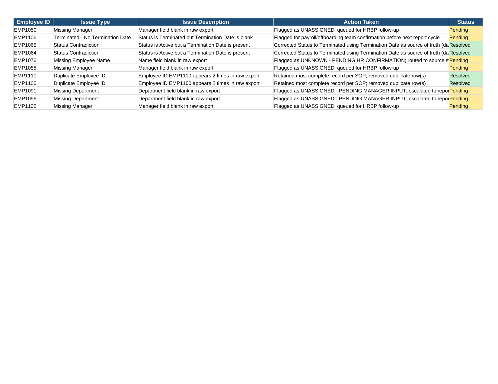
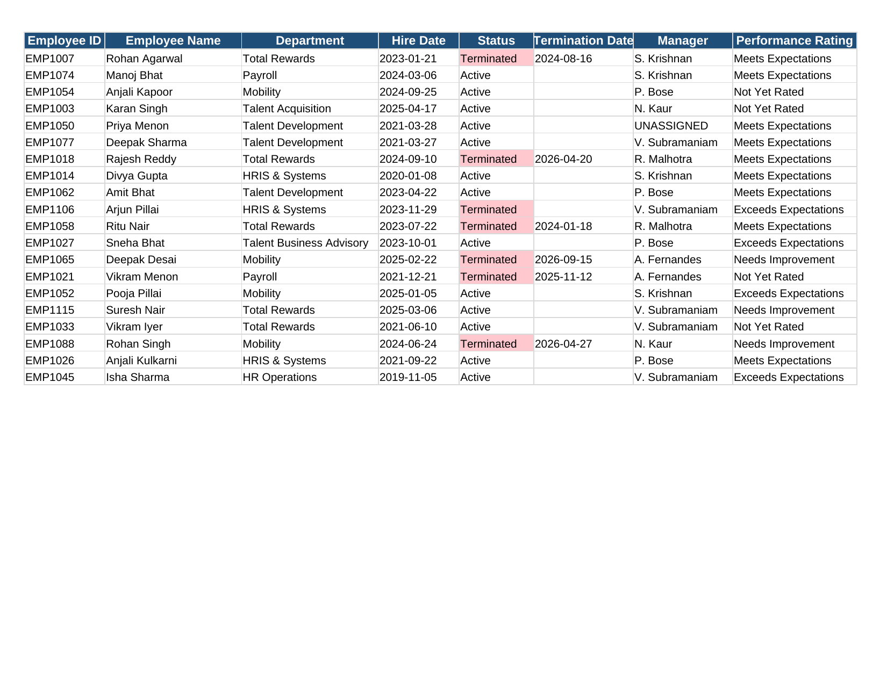
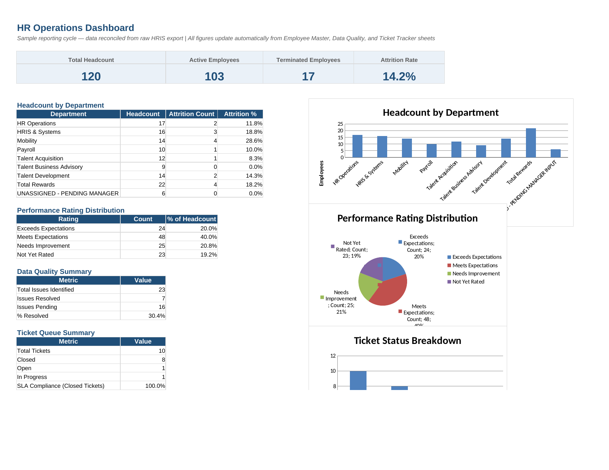
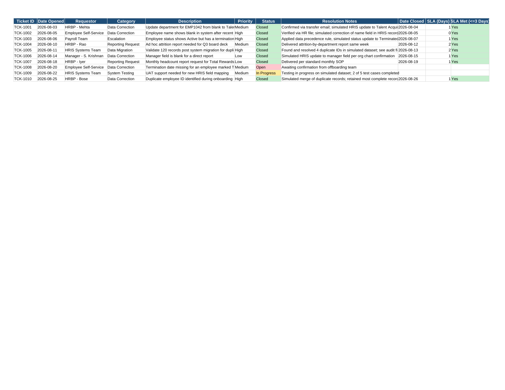

# HR Operations & HRIS Data Quality Management — Portfolio Project

**Tools used:** Microsoft Excel (formulas, formula-driven summaries, conditional formatting, charts), CSV data files

This is a simulated HR Operations project built using synthetic employee data. It does not use or claim experience with any specific commercial HRIS platform (e.g., SAP SuccessFactors, ServiceNow) — it demonstrates the underlying data validation, reconciliation, reporting, ticket-handling, and documentation processes using Excel and CSV files only.

---

## 1. Project Overview & Objective

HR shared-services teams regularly receive employee data exports that contain errors — duplicate records, missing fields, or conflicting statuses — and need to clean, validate, and report on that data accurately.

**Objective:** Simulate this end-to-end workflow —

**Raw HRIS export → Data audit → Reconciliation → Workforce reporting → Ticket tracking → SOP documentation**

— to demonstrate the core skills required for an HR Operations / Talent Processes role: data accuracy, Excel-based reporting, process documentation, and cross-functional issue tracking.

---

## 2. Dataset, Data Cleaning & Reconciliation

A simulated raw HR data export of **124 employee records** was created with realistic data problems deliberately built in — the kind a real monthly HRIS export could contain.

| Step | Detail |
|---|---|
| Raw records | 124 |
| Duplicate rows removed | 4 |
| Final reconciled records | **120** |

**Files:**
- `data/raw/employees_raw.csv` — the raw export, before cleanup
- `data/processed/employees_cleaned.csv` — the reconciled dataset after cleanup

**Cleaning rules applied:**
- Duplicate Employee IDs → kept the most complete record, removed the rest
- Conflicting Status/Termination Date → the Termination Date (system-generated) was treated as the source of truth over a manually entered Status field
- Missing fields (Name, Department, Manager) → flagged clearly (e.g., "UNASSIGNED") rather than deleted, so no employee is silently dropped from headcount
- Inconsistent date formats → standardized to one format across the dataset

---

## 3. HR Data Quality Audit

Every record was checked against the cleaning rules above, and every issue found was logged with the action taken.

| Metric | Value |
|---|---|
| Total data-quality findings | **23** |
| Resolved outright | **7** (duplicates removed, status conflicts corrected) |
| Flagged for follow-up | **16** (missing fields, missing termination dates — routed to the appropriate owner rather than guessed at) |

**Issue breakdown:**

| Issue Type | Count |
|---|---|
| Missing Department | 6 |
| Missing Manager | 5 |
| Duplicate Employee ID | 4 |
| Terminated – No Termination Date | 3 |
| Status Contradiction (Active + Termination Date present) | 3 |
| Missing Employee Name | 2 |

**File:** `data/processed/data_quality_issues.csv` — the full row-level log
**Report:** `reports/audit_findings.md` — the narrative write-up of the audit

**Screenshot — Data Quality log (Excel):**



---

## 4. HR KPIs & Analysis

Key workforce metrics calculated from the reconciled dataset:

| KPI | Value |
|---|---|
| Total Headcount | 120 |
| Active Employees | 103 |
| Terminated Employees | 17 |
| **Attrition Rate** | **14.2%** |

**Headcount & Attrition by Department:**

| Department | Headcount | Attrition Count | Attrition % |
|---|---|---|---|
| Total Rewards | 22 | 4 | 18.2% |
| HR Operations | 17 | 2 | 11.8% |
| HRIS & Systems | 16 | 3 | 18.8% |
| Mobility | 14 | 4 | 28.6% |
| Talent Development | 14 | 2 | 14.3% |
| Talent Acquisition | 12 | 1 | 8.3% |
| Payroll | 10 | 1 | 10.0% |
| Talent Business Advisory | 9 | 0 | 0.0% |
| Unassigned (pending manager input) | 6 | 0 | 0.0% |

**Performance Rating Distribution:**

| Rating | Count | % of Headcount |
|---|---|---|
| Meets Expectations | 48 | 40.0% |
| Needs Improvement | 25 | 20.8% |
| Exceeds Expectations | 24 | 20.0% |
| Not Yet Rated | 23 | 19.2% |

**Report:** `reports/headcount_attrition_summary.md`

**Screenshot — Employee Master (Excel):**



---

## 5. HR Operations Dashboard (Screenshots)

A single-view Excel dashboard was built with **live formulas** (`COUNTIF`, `COUNTIFS`, `IFERROR`) referencing the other sheets — every number recalculates automatically if the underlying data changes. It includes KPI cards, summary tables, and charts.

**File:** `reports/HR_Operations_Dashboard.xlsx`



The workbook has 4 sheets:

| Sheet | Purpose |
|---|---|
| **Dashboard** | KPI cards, department/performance/data-quality/ticket summaries, and 3 charts |
| **Employee Master** | All 120 reconciled records, with conditional formatting flagging terminated employees |
| **Data Quality** | The row-level audit log, color-coded Resolved (green) / Pending (yellow) |
| **Ticket Tracker** | The 10-ticket queue with an SLA formula and SLA-met flag |

---

## 6. Ticket Management & Process Documentation

To simulate how these activities would actually arrive as inbound requests in an HR shared-services team, a **10-ticket case queue** was created covering data corrections, reporting requests, an escalation, a data migration validation, and system testing/UAT support.

| Metric | Value |
|---|---|
| Total Tickets | 10 |
| Closed | 8 |
| Open | 1 |
| In Progress | 1 |
| SLA Compliance (closed tickets, ≤3-day target) | 100% |

**File:** `tickets/ticket_queue.csv`

**Screenshot — Ticket Tracker (Excel):**



**Process documentation:**
- `sops/SOP_Monthly_Headcount_Report.md` — the recurring monthly reporting process, written as a repeatable SOP
- `sops/JobAid_Data_Correction_Request.md` — a step-by-step job aid for handling an inbound data correction request

---

## 7. Key Insights

- **Mobility (28.6%) and HRIS & Systems (18.8%) have the highest attrition** among departments with meaningful headcount — worth flagging to leadership as areas to watch.
- **16 of 23 data-quality findings are still pending follow-up**, not resolved outright — this reflects a realistic HR operations pattern: some issues (missing fields, missing dates) need confirmation from a source-system owner or manager, not a unilateral fix.
- **19.2% of employees are "Not Yet Rated"** on performance, close to the size of the "Exceeds Expectations" group — a meaningful gap in performance-cycle completion.
- **Every closed ticket met the 3-day SLA target** in this sample queue, suggesting the case-handling process is workable at this data volume.
- Records with missing department or manager data were **retained, not deleted**, so headcount reporting stays accurate rather than silently understating actual headcount.

---

## 8. Conclusion & Recommendations

This project demonstrates a complete, realistic HR Operations workflow — from a messy raw data export through to a validated, reportable dataset and a live Excel dashboard — using the core skill set an HR Operations / Talent Processes role requires: **data validation, reconciliation, Excel-based reporting, ticket handling, and SOP documentation.**

**If this were a real, ongoing process, next steps would include:**
1. Following up on the 16 pending data-quality findings with the relevant managers/HRBPs before the next reporting cycle
2. Investigating the higher attrition in Mobility and HRIS & Systems
3. Closing the performance-rating gap by prioritizing the "Not Yet Rated" group for the next review cycle
4. Formalizing the data-precedence rule (system field overrides manual field) as a standing part of the monthly SOP, since it was the single most common type of correction needed

---

## Project Structure

```
hr-ops-portfolio-project/
├── README.md
├── LICENSE
├── .gitignore
├── data/
│   ├── raw/
│   │   └── employees_raw.csv
│   └── processed/
│       ├── employees_cleaned.csv
│       └── data_quality_issues.csv
├── reports/
│   ├── audit_findings.md
│   ├── headcount_attrition_summary.md
│   └── HR_Operations_Dashboard.xlsx
├── screenshots/
│   ├── dashboard.png
│   ├── employee_master.png
│   ├── data_quality.png
│   └── ticket_tracker.png
├── sops/
│   ├── SOP_Monthly_Headcount_Report.md
│   └── JobAid_Data_Correction_Request.md
└── tickets/
    └── ticket_queue.csv
```

## Note
All employee names, IDs, and data in this repository are synthetically generated for demonstration purposes only.
